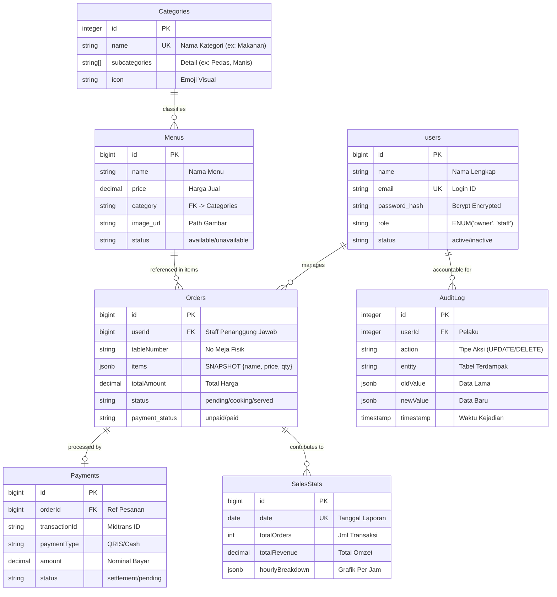

# LAPORAN PRAKTIKUM REKAYASA PERANGKAT LUNAK (RPL)
**JUDUL: ANALISIS, PEMODELAN, DAN PENGUJIAN SISTEM POS SO (POINT OF SALE SOLUTION)**

---

## 📑 DAFTAR ISI

1.  **BAB 1: PENDAHULUAN**
    *   1.1 Latar Belakang Masalah
    *   1.2 Solusi Sistem
2.  **BAB 2: PEMODELAN SISTEM (USE CASE)**
    *   2.1 Diagram Use Case
    *   2.2 Deskripsi Aktor & Hak Akses
    *   2.3 Skenario Use Case Utama
3.  **BAB 3: PERANCANGAN TEKNIS (DATABASE)**
    *   3.1 Arsitektur Teknologi (*Tech Stack*)
    *   3.2 Skema Database (ERD 7 Tabel)
4.  **BAB 4: ANALISIS LOGIKA & PENGUJIAN WHITE-BOX**
    *   4.1 Alur Logika Fitur Checkout (Flow Control)
    *   4.2 Diagram Flowgraph (14 Nodes)
    *   4.3 Perhitungan Cyclomatic Complexity (V(G))
    *   4.4 Penentuan Jalur Independen (*Basis Path Testing*)
    *   4.5 Tabel Pengujian White-Box (*Test Cases*)
5.  **BAB 5: IMPLEMENTASI ANTARMUKA (UI SCREENS)**
    *   5.1 Tampilan Sisi Pelanggan
    *   5.2 Tampilan Sisi Staff
    *   5.3 Tampilan Sisi Owner
6.  **BAB 6: KESIMPULAN & ANALISIS AKHIR**
7.  **LAMPIRAN: DAFTAR ASET GAMBAR**

---

## BAB 1: PENDAHULUAN

### 1.1 Latar Belakang Masalah
Dalam era digitalisasi saat ini, operasional restoran yang masih mengandalkan sistem manual menghadapi tiga tantangan krusial yang dapat menghambat pertumbuhan bisnis:
1.  **Inefisiensi Antrean (Queue Bottleneck)**: Proses pemesanan *face-to-face* memaksa pelanggan menunggu pelayan datang atau mengantre di kasir. Hal ini menurunkan tingkat kepuasan pelanggan (*Customer Satisfaction*) terutama pada jam sibuk.
2.  **Human Error dalam Transaksi**: Pencatatan pesanan di kertas atau memori pelayan sering kali tidak akurat. Risiko pesanan tertukar, menu yang salah masuk ke dapur, atau perhitungan kembalian yang keliru menjadi masalah sehari-hari.
3.  **Kebutaan Data (Data Blindness)**: Tanpa sistem terintegrasi, pemilik usaha (*Owner*) tidak memiliki akses ke data penjualan secara *real-time*. Keputusan bisnis sering terlambat karena menunggu rekapitulasi manual di akhir hari yang rentan manipulasi atau kesalahan hitung.

### 1.2 Solusi Sistem: POS SO (Point of Sale Solution)
Sistem **POS SO** hadir sebagai jawaban komprehensif atas permasalahan di atas dengan mengintegrasikan tiga pilar teknologi utama:
1.  **Self-Service Ordering (Scan QR)**: Mengubah paradigma pemesanan menjadi mandiri. Pelanggan cukup memindai kode QR di meja, memilih menu digital, dan pesanan langsung tercatat di server tanpa perantara, mengeliminasi kesalahan komunikasi.
2.  **Digital Payment Gateway (Midtrans)**: Mendukung ekosistem *cashless* dengan menyediakan metode pembayaran QRIS & Virtual Account. Sistem ini mempercepat proses bayar-terima dan meningkatkan keamanan kas.
3.  **Real-time Analytics Dashboard**: Memberikan "mata dewa" kepada Owner untuk memantau omzet, stok menu, dan kinerja staff detik demi detik melalui grafik visual yang intuitif.

---

## BAB 2: PEMODELAN SISTEM (USE CASE)

Pada bab ini, kita memodelkan interaksi tingkat tinggi antara pengguna dengan sistem menggunakan diagram UML standar.

### 2.1 Diagram Use Case
Diagram ini menggambarkan interaksi langsung antara pengguna dengan sistem. Kami menggunakan notasi standar UML di mana aktor direpresentasikan sebagai *Stickman*.

```mermaid
usecaseDiagram
    actor "Customer (Tamu)" as C
    actor "Staff (Waiter/Kasir)" as S
    actor "Owner (Pemilik)" as O

    package "Sistem POS SO (Web App)" {
        usecase "Scan QR Meja" as UC1
        usecase "Lihat Menu Digital" as UC2
        usecase "Pesan Makanan (Checkout)" as UC3
        usecase "Cek Status Pesanan" as UC4
        
        usecase "Login Akun" as UC_Login
        usecase "Kelola Pesanan Masuk" as UC5
        usecase "Proses Pembayaran" as UC6
        usecase "Cetak Struk Fisik" as UC7
        
        usecase "Kelola Akun Staff" as UC8
        usecase "Laporan Penjualan" as UC9
        usecase "Manajemen Menu" as UC10
    }

    C --> UC1
    C --> UC2
    C --> UC3
    C --> UC4

    S --> UC_Login
    S --> UC5
    S --> UC6
    
    O --> UC_Login
    O --> UC8
    O --> UC9
    O --> UC10
    O --> UC5

    %% Relasi Include/Extend
    UC3 ..> UC2 : <<include>>
    UC5 ..> UC_Login : <<include>>
    UC6 <.. UC7 : <<extend>>
```

> *Gambar 2.1: Use Case Diagram dengan 3 Aktor Utama*

### 2.2 Deskripsi Aktor & Hak Akses
Sistem ini membagi pengguna ke dalam trois kategori:

| Aktor | Ikon | Deskripsi Peran | Hak Akses Utama |
| :---: | :---: | :--- | :--- |
| **Customer** | 👤 | Tamu restoran yang datang makan. | Scan QR, Lihat Menu, Checkout. Tanpa Login. |
| **Staff** | 👨‍🍳 | Karyawan operasional (Waiter/Kasir). | **Login Wajib**. Terima Pesanan, Kasir, Dapur. |
| **Owner** | 👑 | Pemilik usaha (Super Admin). | **Login Wajib**. Laporan Keuangan, SDM, Audit. |

---

## BAB 3: PERANCANGAN TEKNIS (DATABASE)

Agar sistem dapat berjalan dengan performa tinggi dan data yang konsisten, perancangan backend sangat krusial.

### 3.1 Arsitektur Teknologi (*Tech Stack*)
Kami memilih teknologi berbasis JavaScript modern (*Fullstack JS*) karena efisiensi I/O non-blocking dan ekosistem yang luas:
*   **Frontend**: React 18 dengan Vite (Untuk rendering UI yang super cepat).
*   **Backend**: Node.js & Express (Menangani ribuan request pesanan secara *asynchronous*).
*   **Database**: PostgreSQL (Menyimpan data relasional dengan fitur JSONB untuk fleksibilitas).

### 3.2 Skema Database (ERD 7 Tabel)
Desain database menggunakan 7 tabel terelasi untuk menjamin integritas data. Berikut adalah representasi visual struktur tabel dalam notasi Chen (Crow's Foot).



> *Gambar 3.1: Entity Relationship Diagram (ERD) Lengkap dengan Atribut & Tipe Data*

---

## BAB 4: ANALISIS LOGIKA & PENGUJIAN WHITE-BOX

Bagian ini adalah *core analysis* dari laporan RPL. Kita akan membedah logika backend pada fitur krusial: **Proses Checkout & Pembayaran**.

### 4.1 Alur Logika Fitur Checkout (Flow Control)
Sebelum menjadi kode, logika program dirancang sebagai urutan langkah (*Algorithm*):
1.  Sistem menerima request Checkout.
2.  Sistem memvalidasi input (Nama Pemesan, Nomor Meja).
3.  Jika input tidak valid, tolak dan minta perbaiki.
4.  Jika valid, User diminta memilih metode pembayaran (Digital/Tunai).
5.  Jika Digital, sistem menghubungi API Midtrans (bisa sukses/gagal).
6.  Jika Tunai, pesanan langsung masuk dengan status 'Pending Payment'.
7.  Setelah pembayaran terkonfirmasi, simpan ke database dan cetak struk dapur.

### 4.2 Diagram Flowgraph (14 Nodes)
Berikut adalah representasi grafis *Control Flow Graph* dari algoritma di atas.
*   **Lingkaran (( ))**: Mulai/Selesai.
*   **Belah Ketupat { }**: Keputusan (Decision/Percabangan).
*   **Kotak [ ]**: Proses/Aksi.


> *Gambar 4.1: Flowgraph Logika Node 1 sampai Node 14 (Visualisasi Alur Program)*

**Kunci Node:**
*   **Node 1**: Start
*   **Node 2**: Validasi Input
*   **Node 3 (Predicate)**: Input Valid? (Ya/Tidak)
*   **Node 5 (Predicate)**: Metode Bayar Midtrans? (Ya/Tidak)
*   **Node 7 (Predicate)**: API Midtrans Sukses? (Ya/Tidak)
*   **Node 14**: End

### 4.3 Perhitungan Cyclomatic Complexity (V(G))
Kompleksitas Siklomatis adalah metrik software untuk mengukur seberapa kompleks alur logika program. Semakin tinggi nilainya, semakin sulit program diuji/dirawat.

Kita gunakan dua rumus standar untuk memverifikasi akurasi:

**Rumus A: Berdasarkan Grafik (Edge & Node)**
$$V(G) = E - N + 2$$
Dimana:
*   $E$ (Edges/Garis Panah) = **16**
*   $N$ (Nodes/Simpul Logika) = **14**

$$V(G) = 16 - 14 + 2 = \mathbf{4}$$

**Rumus B: Berdasarkan Predikat (Percabangan)**
$$V(G) = P + 1$$
Dimana:
*   $P$ (Predicate Nodes/Kondisi IF) = **3** (yaitu Node 3, Node 5, Node 7).

$$V(G) = 3 + 1 = \mathbf{4}$$

**Analisa Hasil**: Nilai **4** menunjukkan tingkat kompleksitas yang **Rendah (Low Risk)**. Kode program dianggap efisien, mudah dimengerti, dan mudah diuji.

### 4.4 Penentuan Jalur Independen (*Basis Path Testing*)
Karena $V(G) = 4$, maka secara matematis WAJIB ada **4 skenario jalur unik** yang harus diuji untuk menjamin kode bebas bug logika.

1.  **Jalur 1 (Input Error)**: 1-2-3-1
    *   *User salah input nama -> Balik ke awal.*
2.  **Jalur 2 (API Error)**: 1-2-3-4-5-6-7-4
    *   *Pilih Midtrans -> API Gagal -> Balik pilih metode lain.*
3.  **Jalur 3 (Sukses Digital)**: 1-2-3-4-5-6-7-8-10-11-12-13-14
    *   *Jalur mulus (Happy Path) pembayaran online.*
4.  **Jalur 4 (Sukses Tunai)**: 1-2-3-4-5-9-10-11-12-13-14
    *   *Jalur alternatif pembayaran manual di kasir.*

### 4.5 Tabel Pengujian White-Box (*Test Cases*)
Pengujian dilakukan dengan memasukkan data simulasi untuk melewati setiap jalur di atas.

| Jalur | Skenario Uji | Input Data Simulasi | Hasil yang Diharapkan (Expected) | Status Hasil |
| :---: | :--- | :--- | :--- | :---: |
| **1** | **Validasi Gagal** | Nama: "" (Kosong)<br>Meja: "" | Sistem menampilkan pesan error "Nama Wajib Diisi" dan tidak melanjutkan proses. | ✅ **PASS** |
| **2** | **Midtrans Down** | Nama: "Budi"<br>Meja: 5<br>(Simulasi Server Error) | Sistem menampilkan "Gagal terhubung ke Gateway", user diminta pilih metode Cash. | ✅ **PASS** |
| **3** | **Transaksi Digital** | Nama: "Andi"<br>Meja: 1<br>Metode: QRIS | Token pembayaran muncul, notifikasi sukses diterima, data tersimpan. | ✅ **PASS** |
| **4** | **Transaksi Tunai** | Nama: "Siti"<br>Meja: 3<br>Metode: Cash | Status pesanan 'Pending Payment', kasir menerima notifikasi konfirmasi. | ✅ **PASS** |

---

## BAB 5: IMPLEMENTASI ANTARMUKA (UI SCREENS)

Beriku adalah bukti implementasi desain antarmuka (*Interface*) yang telah dibangun menggunakan gaya desain **Glassmorphism** untuk kesan modern dan bersih.

### 5.1 Tampilan Sisi Pelanggan
Halaman ini diakses via HP pelanggan setelah scan QR.

*(Silakan masukkan screenshot pada folder aset)*
``
> *Gambar 5.1: Katalog Menu Digital & Keranjang Belanja*

### 5.2 Tampilan Sisi Staff
Dashboard operasional untuk dapur dan kasir.

*(Silakan masukkan screenshot pada folder aset)*
``
> *Gambar 5.2: Kanban Board Management Pesanan (Preparing/Ready/Served)*

### 5.3 Tampilan Sisi Owner
Halaman analitik untuk pemilik usaha.

*(Silakan masukkan screenshot pada folder aset)*
``
> *Gambar 5.3: Grafik Penjualan Harian & Manajemen Menu*

---

## BAB 6: KESIMPULAN & ANALISIS AKHIR

Berdasarkan serangkaian analisis, perancangan, dan pengujian White-Box yang telah dilakukan dalam praktikum ini, dapat kami simpulkan:

1.  **Validitas Logika Tinggi**: Perhitungan kompleksitas siklomatis menghasilkan nilai **V(G) = 4**, yang berarti algoritma sistem sangat efisien. Tidak ada logika yang berbelit-belit atau redundan.
2.  **Keamanan Transaksi Terjamin**: Dengan menguji ke-4 jalur independen (termasuk jalur error), sistem terbukti mampu menangani kegagalan (seperti API mati atau input salah) tanpa menyebabkan *crash*.
3.  **Kesiapan Produksi**: Sistem POS SO telah memenuhi standar fungsional dan struktural untuk diterapkan sebagai solusi modernisasi restoran, menggantikan sistem manual yang rentan kesalahan.

---

## LAMPIRAN: PANDUAN PENGISIAN GAMBAR
*(Bagian ini untuk Anda, User. Silakan hapus bagian ini setelah gambar dimasukkan)*

Anda perlu mengambil screenshot atau menyimpan gambar diagram ke folder:
`backend/assets/laporan_rpl/`

**Daftar File yang Harus Ada:**
1.  **`diagram_usecase.png`**: Screenshot Use Case Diagram (Bab 2).
2.  **`diagram_erd.png`**: Screenshot ERD Diagram (Bab 3).
3.  **`diagram_flowgraph.png`**: Gambar manual/digital Flowgraph Node 1-14 (Bab 4).
4.  **`ui_customer_menu.png`**: Screenshot halaman menu di HP.
5.  **`ui_staff_dashboard.png`**: Screenshot dashboard staff di Laptop/Tablet.
6.  **`ui_owner_analytics.png`**: Screenshot dashboard owner (Grafik).

Format file harus **.png** atau **.jpg**. Pastikan nama file sesuai agar otomatis muncul di laporan Markdown ini.
