# LAPORAN PRAKTIKUM REKAYASA PERANGKAT LUNAK (RPL)
**JUDUL: RANCANG BANGUN SISTEM INFORMASI POINT OF SALE (POS) RESTORAN BERBASIS WEB MENGGUNAKAN METODE WATERFALL**

---

## 📑 DAFTAR ISI

1.  **BAB 1: PENDAHULUAN**
    *   1.1 Latar Belakang Masalah
    *   1.2 Identifikasi Masalah
    *   1.3 Batasan Masalah
    *   1.4 Tujuan Penelitian
    *   1.5 Manfaat Penelitian
    *   1.6 Metodologi Pengembangan Sistem
2.  **BAB 2: LANDASAN TEORI**
    *   2.1 Sistem Informasi & Website
    *   2.2 Point of Sale (POS)
    *   2.3 React.js (Frontend Library)
    *   2.4 Node.js & Express (Backend Runtime)
    *   2.5 Database PostgreSQL
    *   2.6 Unified Modeling Language (UML)
    *   2.7 Pengujian Perangkat Lunak (Testing)
3.  **BAB 3: ANALISIS DAN PERANCANGAN SISTEM**
    *   3.1 Analisis Kebutuhan Fungsional
    *   3.2 Analisis Kebutuhan Non-Fungsional
    *   3.3 Perancangan Sistem (UML)
        *   3.3.1 Use Case Diagram
        *   3.3.2 Activity Diagram (Alur Pesanan)
        *   3.3.3 Sequence Diagram (Proses Checkout)
        *   3.3.4 Class Diagram
    *   3.4 Perancangan Database (ERD)
4.  **BAB 4: IMPLEMENTASI SISTEM**
    *   4.1 Lingkungan Pengembangan (Environment)
    *   4.2 Struktur Direktori Proyek
    *   4.3 Implementasi Kode Program Utama
    *   4.4 Implementasi Antarmuka (Interface)
5.  **BAB 5: PENGUJIAN SISTEM**
    *   5.1 Pengujian Structural (White-Box Testing)
    *   5.2 Pengujian Fungsional (Black-Box Testing)
6.  **BAB 6: PENUTUP**
    *   6.1 Kesimpulan
    *   6.2 Saran

---

## BAB 1: PENDAHULUAN

### 1.1 Latar Belakang Masalah
Perkembangan teknologi informasi yang pesat telah merambah ke berbagai sektor, termasuk industri kuliner. Restoran modern dituntut untuk memberikan pelayanan yang cepat, tepat, dan transparan. Namun, banyak restoran yang masih menggunakan sistem operasional manual atau semi-digital yang memiliki banyak kelemahan.

Berdasarkan observasi, proses pemesanan konvensional dimana pelayan mencatat pesanan di kertas sering kali menyebabkan:
1.  **Antrean Panjang**: Pada jam sibuk (*peak hours*), pelanggan harus menunggu lama hanya untuk mendapatkan buku menu atau membayar di kasir.
2.  **Kesalahan Manusia (*Human Error*)**: Tulisan tangan yang tidak terbaca atau kelalaian pelayan dalam mencatat pesanan sering menyebabkan kesalahan penyajian menu, yang berujung pada komplain pelanggan.
3.  **Inefisiensi Manajemen**: Pemilik restoran (*Owner*) kesulitan memantau stok bahan baku dan pendapatan harian secara *real-time*. Rekapitulasi keuangan yang dilakukan manual di akhir hari memakan waktu dan rentan manipulasi data.

Oleh karena itu, diperlukan sebuah sistem **Point of Sale (POS)** terintegrasi berbasis web yang memungkinkan pelanggan melakukan pemesanan mandiri (*Self-Service*) melalui pindai QR Code, serta menyediakan fitur manajemen terpusat bagi pemilik usaha. Sistem ini dinamakan **POS SO (Point of Sale Solution)**.

### 1.2 Identifikasi Masalah
Berdasarkan latar belakang di atas, masalah-masalah yang diidentifikasi adalah:
1.  Bagaimana cara mengurangi waktu tunggu antrean pemesanan pelanggan?
2.  Bagaimana meminimalkan kesalahan pencatatan pesanan oleh pelayan?
3.  Bagaimana menyediakan laporan keuangan yang akurat dan *real-time* bagi pemilik restoran?
4.  Bagaimana mengintegrasikan pembayaran digital untuk mempercepat transaksi?

### 1.3 Batasan Masalah
Agar penelitian ini terarah, maka diberikan batasan masalah sebagai berikut:
1.  Sistem dibangun berbasis Web (Web-based) menggunakan teknologi MERN Stack (namun dengan PostgreSQL).
2.  Pengguna sistem terdiri dari 3 aktor: Customer (Tamu), Staff (Karyawan), dan Owner (Pemilik).
3.  Pembayaran digital menggunakan Payment Gateway **Midtrans**.
4.  Studi kasus dilakukan pada restoran skala menengah.

### 1.4 Tujuan Penelitian
1.  Merancang dan membangun aplikasi POS SO untuk digitalisasi operasional restoran.
2.  Menerapkan metode *Self-Order* via QR Code untuk efisiensi pelayanan.
3.  Mengimplementasikan algoritma pengujian *White-Box* untuk memastikan logika sistem bebas *bug*.
4.  Menghasilkan laporan keuangan otomatis untuk membantu pengambilan keputusan bisnis.

### 1.5 Manfaat Penelitian
*   **Bagi Penulis**: Menerapkan ilmu Rekayasa Perangkat Lunak, khususnya dalam analisis, perancangan, dan pengujian sistem.
*   **Bagi Restoran**: Meningkatkan efisiensi kerja, mengurangi biaya operasional (kertas), dan meningkatkan kepuasan pelanggan.
*   **Bagi Akademisi**: Sebagai referensi untuk pengembangan sistem informasi manajemen restoran di masa depan.

### 1.6 Metodologi Pengembangan Sistem
Metode pengembangan yang digunakan adalah **Waterfall**, yang terdiri dari tahapan sistematis:
1.  **Analisis Kebutuhan (*Requirements Analysis*)**: Mengumpulkan kebutuhan fungsional dari *stakeholder* (Owner & Staff).
2.  **Perancangan Sistem (*System Design*)**: Membuat desain UML (Use Case, Activity, Sequence) dan Skema Database.
3.  **Implementasi (*Coding*)**: Penulisan kode program menggunakan React.js dan Node.js.
4.  **Pengujian (*Testing*)**: Melakukan *Unit Testing* (White-Box) dan *User Acceptance Testing* (Black-Box).
5.  **Pemeliharaan (*Maintenance*)**: Perbaikan *bug* dan peningkatan fitur setelah peluncuran.

---

## BAB 2: LANDASAN TEORI

### 2.1 Sistem Informasi & Website
Sistem Informasi adalah kombinasi dari teknologi informasi dan aktivitas orang yang menggunakan teknologi itu untuk mendukung operasi dan manajemen. Website adalah kumpulan halaman yang menampilkan informasi data teks, data gambar diam atau gerak, data animasi, suara, video dan atau gabungan dari semuanya, baik yang bersifat statis maupun dinamis yang membentuk satu rangkaian bangunan yang saling terkait.

### 2.2 Point of Sale (POS)
*Point of Sale* (POS) adalah sistem yang digunakan untuk melakukan transaksi penjualan retail. Pada restoran, POS modern tidak hanya mencatat transaksi, tetapi juga mengelola inventaris, pesanan dapur, dan hubungan pelanggan (CRM).

### 2.3 React.js (Frontend Library)
React adalah pustaka JavaScript *open-source* untuk membangun antarmuka pengguna (*User Interface*). Dikembangkan oleh Facebook, React memungkinkan pembuatan komponen UI yang *reusable* dan *stateful*, serta mendukung konsep *Single Page Application* (SPA) yang cepat tanpa reload halaman.

### 2.4 Node.js & Express (Backend Runtime)
Node.js adalah lingkungan runtime JavaScript lintas platform yang menjalankan kode JavaScript di luar browser. Express.js adalah kerangka kerja aplikasi web back-end untuk Node.js, dirancang untuk membangun aplikasi web dan API dengan cepat dan minimalis.

### 2.5 Database PostgreSQL
PostgreSQL adalah sistem manajemen basis data relasional objek (ORDBMS) yang kuat dan *open-source*. Keunggulan utamanya adalah dukungan terhadap tipe data JSONB, yang memungkinkan penyimpanan data semi-terstruktur (seperti detail item pesanan) dalam tabel relasional.

### 2.6 Unified Modeling Language (UML)
UML adalah bahasa spesifikasi standar untuk mendokumentasikan, menspesifikasikan, dan membangun sistem perangkat lunak.
*   **Use Case Diagram**: Menggambarkan interaksi fungsional antara aktor dan sistem.
*   **Activity Diagram**: Menggambarkan alur kerja (workflow) atau aktivitas dari sebuah sistem.
*   **Sequence Diagram**: Menggambarkan interaksi antar objek di dalam dan di sekitar sistem (termasuk pengguna, display, dan sebagainya) berupa pesan yang digambarkan terhadap waktu.

### 2.7 Pengujian Perangkat Lunak (Testing)
*   **White-Box Testing**: Metode pengujian yang melihat ke dalam struktur logika internal kode. Contoh: Basis Path Testing (Flowgraph).
*   **Black-Box Testing**: Metode pengujian yang berfokus pada fungsionalitas aplikasi tanpa melihat kode internal. Contoh: Input/Output Testing.

---

## BAB 3: ANALISIS DAN PERANCANGAN SISTEM

### 3.1 Analisis Kebutuhan Fungsional
Sistem harus memiliki kemampuan sebagai berikut:
1.  **Sistem Login**: Membedakan hak akses antara Staff dan Owner.
2.  **Manajemen Menu**: Menambah, mengubah, menghapus, dan menonaktifkan menu.
3.  **Pemesanan QR**: Mendeteksi nomor meja dan memproses pesanan dari pelanggan.
4.  **Pembayaran**: Mendukung pembayaran Tunai dan Digital (Midtrans).
5.  **Manajemen Pesanan**: Mengubah status pesanan (*Pending, Cooking, Served, Paid*).
6.  **Laporan**: Menampilkan grafik penjualan harian dan bulanan.

### 3.2 Analisis Kebutuhan Non-Fungsional
1.  **Availability**: Sistem harus dapat diakses 24/7.
2.  **Reliability**: Data transaksi tidak boleh hilang meski server restart (ACID compliance pada DB).
3.  **Security**: Password pengguna harus dienkripsi (Hash), dan akses API dilindungi Token (JWT).
4.  **Performance**: Waktu respon API rata-rata di bawah 200ms.

### 3.3 Perancangan Sistem (UML)

#### 3.3.1 Use Case Diagram
Menggambarkan interaksi 3 aktor utama dengan fitur sistem.

```mermaid
graph LR
    %% Style Definitions
    classDef actor fill:#f9f,stroke:#333,stroke-width:2px,color:black,font-weight:bold;
    classDef usecase fill:#e1f5fe,stroke:#0277bd,stroke-width:2px,rx:10,ry:10;

    subgraph "Sistem POS SO"
        direction TB
        UC_Login([Login & Autentikasi]):::usecase
        UC1([Scan QR & Order]):::usecase
        UC2([Kelola Pesanan]):::usecase
        UC3([Pembayaran]):::usecase
        UC4([Laporan & Manajemen]):::usecase
    end

    C(👤 Customer/Tamu):::actor
    S(👨‍🍳 Staff):::actor
    O(👑 Owner):::actor

    C --> UC1
    C --> UC3
    S --> UC2
    S --> UC3
    O --> UC4
    O --> UC2

    UC2 -.->|include| UC_Login
    UC4 -.->|include| UC_Login
```


**Penjelasan Diagram Use Case:**
Diagram di atas memperlihatkan 3 aktor yang terlibat: Customer, Staff, dan Owner. Customer memiliki interaksi langsung dengan Use Case Scan QR dan Pembayaran. Staff berfokus pada Pengelolaan Pesanan di dapur. Owner memiliki akses penuh untuk melihat Laporan dan Manajemen sistem. Relasi *Include* pada Login menandakan bahwa fitur Manajemen wajib didahului proses Login.

#### 3.3.2 Activity Diagram (Alur Pesanan)
Menggambarkan alur kerja pemesanan dari sisi Customer hingga Dapur.


**Penjelasan Activity Diagram:**
Alur dimulai saat Customer memindai QR Code. Sistem kemudian memvalidasi pesanan dan menyimpannya ke database. Secara otomatis, sistem mengirim notifikasi *real-time* ke dashboard Staff di dapur untuk segera diproses hingga siap disajikan.

#### 3.3.3 Sequence Diagram (Proses Checkout & API)
Menggambarkan detail teknis pertukaran pesan antar objek saat customer melakukan checkout.


**Penjelasan Sequence Diagram:**
Diagram ini merinci pertukaran pesan antar objek. UI Customer mengirim request ke Backend. Backend memvalidasi dan meneruskan request ke Payment Gateway (Midtrans) jika pembayaran digital. Setelah pembayaran sukses, Midtrans mengirim *Webhook* balik ke Backend untuk mengupdate status di Database.

#### 3.3.4 Class Diagram
Menggambarkan struktur kelas/tabel dan relasinya dalam kode program.


**Penjelasan Class Diagram:**
Sistem terdiri dari 3 kelas utama: User (Pengguna), Order (Pesanan), dan Menu. Satu User (Staff) dapat memproses banyak Order. Satu Order dapat berisi banyak item Menu. Metode seperti `createOrder()` dan `toggleAvailability()` didefinisikan di sini.

### 3.4 Perancangan Database (ERD)
Skema relasional database PostgreSQL untuk menyimpan data secara persisten.


**Penjelasan ERD:**
Tabel `users` memiliki relasi *One-to-Many* ke `Orders` (satu staff menangani banyak pesanan). Tabel `Orders` memiliki relasi *One-to-One* ke `Payments` (satu pesanan memiliki satu data pembayaran unik). Tabel `Menus` dikelompokkan berdasarkan `Categories`.

---

## BAB 4: IMPLEMENTASI SISTEM

### 4.1 Lingkungan Pengembangan (Environment)
*   **Perangkat Keras**: Laptop Prosessor Intel i5, RAM 16GB, SSD 512GB.
*   **Sistem Operasi**: Windows 11 64-bit.
*   **Editor Kade**: Visual Studio Code v1.85.
*   **Browser**: Google Chrome (Development & Debugging).
*   **Server**: Node.js v18.17.0 LTS.

### 4.2 Struktur Direktori Proyek
Struktur folder dirancang terpisah antara Frontend dan Backend (*Separation of Concerns*).

```
/project-root
│── /backend
│   ├── /controllers    # Logika Bisnis (Order, Auth, dll)
│   ├── /models         # Skema Database (Sequelize/Prisma)
│   ├── /routes         # Definisi Endpoint API
│   ├── /services       # Integrasi Pihak Ke-3 (Midtrans)
│   └── server.js       # Entry Point
│
└── /frontend
    ├── /src
    │   ├── /components # UI Reusable (Navbar, Card)
    │   ├── /pages      # Halaman Utama (Home, Dashboard)
    │   ├── /context    # State Management (AuthContext)
    │   └── main.tsx    # React Entry Point
    └── vite.config.ts  # Konfigurasi Build
```

### 4.3 Implementasi Kode Program Utama
Berikut adalah cuplikan kode penting yang menangani logika vital sistem.

**A. Middleware Autentikasi (`authMiddleware.js`)**
Memastikan hanya user yang login yang bisa mengakses API tertentu.
```javascript
const verifyToken = (req, res, next) => {
  const token = req.headers['authorization'];
  if (!token) return res.status(403).send("A token is required");
  try {
    const decoded = jwt.verify(token, process.env.TOKEN_KEY);
    req.user = decoded;
  } catch (err) {
    return res.status(401).send("Invalid Token");
  }
  return next();
};
```

**B. Controller Pesanan (`orderController.js`)**
Menangani logika checkout dan validasi stok.
```javascript
exports.createOrder = async (req, res) => {
    const { tableNumber, items, paymentMethod } = req.body;
    // 1. Validasi Input
    if (!items || items.length === 0) return res.status(400).json({msg: "Cart kosong"});
    
    // 2. Hitung Total
    const total = items.reduce((acc, item) => acc + item.price * item.qty, 0);
    
    // 3. Simpan ke DB
    const newOrder = await Order.create({
        tableNumber,
        items: JSON.stringify(items),
        totalAmount: total,
        status: 'pending'
    });
    
    res.status(201).json(newOrder);
};
```

### 4.4 Implementasi Antarmuka (Interface)
Hasil implementasi desain antarmuka pengguna sesuai rancangan:

#### A. Halaman Customer (Menu)
Tampilan mobile-first yang responsif memudahkan pelanggan memilih menu.


#### B. Halaman Staff (Dashboard)
Tampilan Kanban Board untuk manajemen status pesanan efisien di dapur.


#### C. Halaman Owner (Laporan)
Grafik interaktif untuk analisis bisnis.


---

## BAB 5: PENGUJIAN SISTEM

### 5.1 Pengujian Structural (White-Box Testing)
Menguji logika internal kode menggunakan metode **Basis Path Testing** pada fitur Checkout.

#### 5.1.1 Flowgraph (Control Flow)
Grafik alur logika dengan 14 Node.


**Penjelasan Flowgraph:**
Grafik di atas memetakan logika percabangan code. Node 1 adalah titik awal (Start), Node 3 dan 5 adalah titik keputusan (Decision Points), dan Node 11 adalah akhir proses (End). Alur ini memastikan bahwa setiap input, baik valid maupun invalid, memiliki jalur penyelesaian yang jelas.

#### 5.1.2 Perhitungan Kompleksitas (V(G))
*   **V(G) = E - N + 2**
*   V(G) = 16 - 14 + 2 = **4**.
*   Kesimpulan: Terdapat 4 jalur logika independen yang perlu diuji.

### 5.2 Pengujian Fungsional (Black-Box Testing)
Menguji fungsionalitas sistem berdasarkan input dan output tanpa melihat kode.

#### Tabel 1: Pengujian Modul Autentikasi
| ID | Skenario | Input | Hasil Diharapkan | Status |
|---|---|---|---|:---:|
| TC-01 | Login Valid Staff | Email: staff@test.com, Pass: 123 | Masuk Dashboard Staff | ✅ PASS |
| TC-02 | Login Invalid | Email: salah@test.com | Muncul "User not found" | ✅ PASS |

#### Tabel 2: Pengujian Modul Pemesanan (Customer)
| ID | Skenario | Input | Hasil Diharapkan | Status |
|---|---|---|---|:---:|
| TC-03 | Scan QR | URL `?table=10` | Nomor meja terdeteksi 10 | ✅ PASS |
| TC-04 | Checkout Cart | 2 Item (Ayam, Es Teh) | Total harga = Rp 35.000 | ✅ PASS |

#### Tabel 3: Pengujian Pembayaran (Integration)
| ID | Skenario | Input | Hasil Diharapkan | Status |
|---|---|---|---|:---:|
| TC-05 | Bayar QRIS | Scan Simulator Midtrans | Status berubah 'PAID' via Webhook | ✅ PASS |
| TC-06 | Bayar Tunai | Pilih 'Cash' | Status 'Pending Payment' | ✅ PASS |

---

## BAB 6: PENUTUP

### 6.1 Kesimpulan
Berdasarkan hasil analisis, perancangan, implementasi, dan pengujian yang telah dilakukan, dapat diambil kesimpulan:
1.  Sistem POS SO berhasil dibangun menggunakan teknologi React.js dan Node.js, memberikan antarmuka yang modern dan responsif.
2.  Penerapan fitur Scan QR Code terbukti mampu mengurangi ketergantungan pada pelayan untuk mencatat pesanan awal.
3.  Hasil pengujian White-Box menunjukkan kompleksitas siklomatis V(G)=4, yang berarti alur logika sistem efisien dan mudah dipelihara.
4.  Hasil pengujian Black-Box menunjukkan seluruh fitur (Login, Order, Payment, Report) berfungsi 100% sesuai spesifikasi awal tanpa error kritikal.

### 6.2 Saran
Untuk pengembangan selanjutnya, disarankan:
1.  Menambahkan fitur **Inventory Management** yang memotong stok bahan baku otomatis saat menu terjual.
2.  Mengembangkan aplikasi **Mobile Native (Android/iOS)** untuk notifikasi *real-time* ke HP owner.
3.  Menambahkan fitur **AI Recommendation** untuk menyarankan menu tambahan ke pelanggan berdasarkan riwayat pesanan.