# LAPORAN PRAKTIKUM REKAYASA PERANGKAT LUNAK (RPL)
**JUDUL: ANALISIS, PEMODELAN, DAN PENGUJIAN SISTEM POS SO (POINT OF SALE SOLUTION)**

---

## 📑 DAFTAR ISI

1.  **BAB 1: PENDAHULUAN**
    *   1.1 Latar Belakang Masalah
    *   1.2 Solusi Sistem
2.  **BAB 2: PEMODELAN SISTEM (USE CASE)**
    *   2.1 Diagram Use Case
    *   2.2 Deskripsi Aktor & Hak Akses
    *   2.3 Skenario Alur Kerja (Workflows)
3.  **BAB 3: PERANCANGAN TEKNIS (DATABASE)**
    *   3.1 Arsitektur Teknologi (*Tech Stack*)
    *   3.2 Skema Database (ERD 7 Tabel)
4.  **BAB 4: ANALISIS LOGIKA & PENGUJIAN WHITE-BOX**
    *   4.1 Diagram Flowgraph (14 Nodes)
    *   4.2 Penjelasan Detail Node Logika
    *   4.3 Perhitungan Cyclomatic Complexity (V(G))
    *   4.4 Penentuan Jalur Independen (*Basis Path Testing*)
    *   4.5 Tabel Pengujian White-Box (*Test Cases*)
5.  **BAB 5: IMPLEMENTASI ANTARMUKA (UI SCREENS)**
    *   5.1 Tampilan Sisi Pelanggan
    *   5.2 Tampilan Sisi Staff
    *   5.3 Tampilan Sisi Owner
6.  **BAB 6: KESIMPULAN & ANALISIS AKHIR**

---

## BAB 1: PENDAHULUAN

### 1.1 Latar Belakang Masalah
Dalam era digitalisasi saat ini, operasional restoran yang masih mengandalkan sistem manual menghadapi tiga tantangan krusial yang dapat menghambat pertumbuhan bisnis:
1.  **Inefisiensi Antrean (Queue Bottleneck)**: Proses pemesanan *face-to-face* memaksa pelanggan menunggu pelayan datang atau mengantre di kasir. Hal ini menurunkan tingkat kepuasan pelanggan (*Customer Satisfaction*) terutama pada jam sibuk.
2.  **Human Error dalam Transaksi**: Pencatatan pesanan di kertas atau memori pelayan sering kali tidak akurat. Risiko pesanan tertukar, menu yang salah masuk ke dapur, atau perhitungan kembalian yang keliru menjadi masalah sehari-hari.
3.  **Kebutaan Data (Data Blindness)**: Tanpa sistem terintegrasi, pemilik usaha (*Owner*) tidak memiliki akses ke data penjualan secara *real-time*. Keputusan bisnis sering terlambat karena menunggu rekapitulasi manual di akhir hari yang rentan manipulasi atau kesalahan hitung.

### 1.2 Solusi Sistem: POS SO (Point of Sale Solution)
Sistem **POS SO** hadir sebagai jawaban komprehensif atas permasalahan di atas dengan mengintegrasikan tiga pilar teknologi utama:
1.  **Self-Service Ordering (Scan QR)**: Mengubah paradigma pemesanan menjadi mandiri. Pelanggan cukup memindai kode QR di meja, memilih menu digital, dan pesanan langsung tercatat di server tanpa perantara, mengeliminasi kesalahan komunikasi.
2.  **Digital Payment Gateway (Midtrans)**: Mendukung ekosistem *cashless* dengan menyediakan metode pembayaran QRIS & Virtual Account. Sistem ini mempercepat proses bayar-terima dan meningkatkan keamanan kas.
3.  **Real-time Analytics Dashboard**: Memberikan "mata dewa" kepada Owner untuk memantau omzet, stok menu, dan kinerja staff detik demi detik melalui grafik visual yang intuitif.

---

## BAB 2: PEMODELAN SISTEM (USE CASE)

Pada bab ini, kita memodelkan interaksi tingkat tinggi antara pengguna dengan sistem menggunakan diagram UML standar.

### 2.1 Diagram Use Case
Diagram ini menggambarkan interaksi langsung antara pengguna dengan sistem. 
*(Catatan: Visualisasi menggunakan `graph` agar kompatibel dengan berbagai renderer Markdown, dengan penandaan Aktor yang jelas)*.

```mermaid
graph LR
    %% Style Definitions
    classDef actor fill:#f9f,stroke:#333,stroke-width:2px,color:black,font-weight:bold;
    classDef usecase fill:#e1f5fe,stroke:#0277bd,stroke-width:2px,rx:10,ry:10;
    classDef boundary fill:white,stroke:#333,stroke-width:2px,stroke-dasharray: 5 5;

    subgraph "Sistem POS SO (Web Application)"
        direction TB
        UC_Login([Login & Autentikasi]):::usecase
        
        %% Customer Zone
        UC1([Scan QR Meja]):::usecase
        UC2([Lihat Menu Digital]):::usecase
        UC3([Pesan Makanan/Checkout]):::usecase
        UC4([Cek Status Pesanan]):::usecase
        
        %% Staff Zone
        UC5([Kelola Pesanan Masuk]):::usecase
        UC6([Proses Pembayaran]):::usecase
        UC7([Cetak Struk Fisik]):::usecase
        
        %% Owner Zone
        UC8([Kelola Akun Staff]):::usecase
        UC9([Laporan Penjualan]):::usecase
        UC10([Manajemen Menu]):::usecase
    end

    %% Actors
    C(👤 Customer/Tamu):::actor
    S(👨‍🍳 Staff/Kasir):::actor
    O(👑 Owner/Pemilik):::actor

    %% Customer interactions
    C --> UC1
    C --> UC2
    C --> UC3
    C --> UC4

    %% Staff interactions
    S --> UC_Login
    S --> UC5
    S --> UC6
    
    %% Owner interactions
    O --> UC_Login
    O --> UC8
    O --> UC9
    O --> UC10
    O --> UC5

    %% Relasi Include/Extend
    UC3 -.->|include| UC2
    UC5 -.->|include| UC_Login
    UC7 -.->|extend| UC6
```

> *Gambar 2.1: Use Case Diagram Sistem POS SO*

### 2.2 Deskripsi Aktor & Hak Akses
Sistem ini membagi pengguna ke dalam tiga kategori aktor berdasarkan peran dan tanggung jawabnya:

| Aktor | Ikon | Deskripsi Peran | Hak Akses Utama |
| :---: | :---: | :--- | :--- |
| **Customer** | 👤 | Tamu restoran yang datang makan. | Scan QR, Lihat Menu, Checkout. Tanpa Login. |
| **Staff** | 👨‍🍳 | Karyawan operasional (Waiter/Kasir). | **Login Wajib**. Terima Pesanan, Kasir, Dapur. |
| **Owner** | 👑 | Pemilik usaha (Super Admin). | **Login Wajib**. Laporan Keuangan, SDM, Audit. |

### 2.3 Skenario Alur Kerja (Workflows)
Penjelasan rinci mengenai bagaimana setiap aktor berinteraksi dengan sistem dalam skenario nyata:

#### A. Alur Customer (Pemesanan Mandiri)
1.  **Scan QR**: Pelanggan duduk dan memindai QR Code yang tertempel di meja menggunakan kamera smartphone.
2.  **Validasi Meja**: Sistem otomatis mendeteksi parameter meja (misal `?table=1`) dari URL QR.
3.  **Browsing**: Pelanggan melihat katalog menu digital yang lengkap dengan foto dan harga.
4.  **Add to Cart**: Pelanggan memilih menu yang diinginkan, menambahkan catatan (misal "Jangan Pedas"), dan memasukkan ke keranjang.
5.  **Checkout & Payment**: Pelanggan melakukan konfirmasi pesanan dan memilih metode pembayaran (Tunai/QRIS). Data pesanan dikirim ke server.
6.  **Tracking**: Layar pelanggan menampilkan status pesanan secara real-time (*Pending* -> *Cooking* -> *Served*).

#### B. Alur Staff (Dapur & Kasir)
1.  **Incoming Order**: Tablet di dapur berbunyi/notifikasi muncul saat pesanan baru masuk dari pelanggan.
2.  **Accept Order**: Koki menekan tombol "Terima", status berubah menjadi *Cooking*.
3.  **Preparation**: Makanan disiapkan.
4.  **Ready to Serve**: Saat makanan matang, staff menekan tombol "Siap Saji", status berubah menjadi *Served*. Pelayan mengantar makanan.
5.  **Payment Verification**: Jika pembayaran tunai, Kasir menerima uang dan memverifikasi status pembayaran menjadi *Paid* di sistem. Staff juga dapat mencetak struk fisik jika diminta.

#### C. Alur Owner (Manajemen & Kontrol)
1.  **Dashboard Monitoring**: Owner login untuk melihat grafik penjualan harian yang *update* setiap detik.
2.  **Menu Management**: Jika stok bahan habis, Owner menonaktifkan menu tertentu agar tidak bisa dipesan pelanggan (*Toggle Availability*).
3.  **Audit Logs**: Owner memantau log aktivitas untuk melihat jam login staff dan mencegah kecurangan.

---

## BAB 3: PERANCANGAN TEKNIS (DATABASE)

Agar sistem dapat berjalan dengan performa tinggi dan data yang konsisten, perancangan backend sangat krusial.

### 3.1 Arsitektur Teknologi (*Tech Stack*)
*   **Frontend**: React 18 dengan Vite (Rendering UI Cepat & Responsif).
*   **Backend**: Node.js & Express (API Server Non-blocking untuk menangani *concurrency* tinggi).
*   **Database**: PostgreSQL (Relational DB dengan fitur JSONB untuk fleksibilitas data item pesanan).

### 3.2 Skema Database (ERD 7 Tabel)
Berikut adalah struktur database lengkap yang digunakan:

> *Gambar 3.1: Entity Relationship Diagram (ERD)*

---

## BAB 4: ANALISIS LOGIKA & PENGUJIAN WHITE-BOX

Bagian ini membedah logika backend pada fitur krusial: **Proses Checkout & Pembayaran**.

### 4.1 Diagram Flowgraph (14 Nodes)
Berikut adalah grafik alur logika program (Control Flow Graph) yang terbagi menjadi 14 node untuk analisis struktural.

> *Gambar 4.1: Flowgraph Logika Node 1 - 14*

### 4.2 Penjelasan Detail Node Logika
Analisis mendalam untuk setiap langkah (Node) pada grafik di atas:

| Node | Proses / Logika | Input & Output |
| :---: | :--- | :--- |
| **1** | **Start Process** | **Input**: User menekan tombol "Proses Pesanan" di Cart. **Output**: Fungsi backend `checkout()` dipanggil. |
| **2** | **Validasi Input** | Sistem memeriksa integritas data payload. **Logic**: Cek apakah `name`, `tableNumber`, dan `items` tidak kosong. |
| **3** | **Decision: Valid?** | **Branching**: Jika data tidak lengkap, kembalikan Error 400 (Bad Request). Jika lengkap, lanjut ke Node 4. |
| **4** | **Pilih Metode** | User memilih metode pembayaran yang diinginkan (QRIS/Bank Transfer/Tunai). |
| **5** | **Decision: Is Midtrans?** | **Branching**: Cek `paymentType`. Jika tipe 'online', masuk alur Digital (Node 6). Jika 'cash', masuk alur Tunai (Node 9). |
| **6** | **Request API Midtrans** | Sistem melakukan Request HTTP ke Server Core API Midtrans untuk meminta Snap Token transaksi. |
| **7** | **Decision: API Success?** | **Branching**: Jika Midtrans merespon dengan Token, lanjut ke Node 8. Jika timeout/error, minta user pilih metode lain. |
| **8** | **Wait Payment** | Sistem menunggu konfirmasi pembayaran sukses dari Webhook Midtrans (Status: *Settlement*). |
| **9** | **Bayar Kasir (Cash)** | Jalur alternatif. Status pembayaran diset sebagai *Unpaid*, menunggu verifikasi manual kasir. |
| **10** | **Set Status Pesanan** | Inisialisasi status pesanan menjadi `PENDING` agar notifikasi masuk ke dashboard dapur. |
| **11** | **Save Database** | **Critical**: Melakukan operasi *Insert* ke tabel `Orders` dan `Payments` dalam satu transaksi atomik. |
| **12** | **Update Statistik** | Trigger fungsi untuk menambahkan total omzet ke tabel `SalesStats` hari ini. |
| **13** | **Print Struk** | Sistem mengirim perintah cetak struk fisik ke printer yang terhubung (opsional). |
| **14** | **End Process** | Mengembalikan respons JSON 200 OK ke Frontend. User diarahkan ke halaman sukses. |

### 4.3 Perhitungan Cyclomatic Complexity (V(G))
Kompleksitas Siklomatis mengukur jumlah jalur independen dalam kode untuk menentukan skenario pengujian minimal.

1.  **Rumus Edge-Node**: 
    $$V(G) = E - N + 2 = 16 - 14 + 2 = \mathbf{4}$$
2.  **Rumus Predikat**: 
    $$V(G) = P + 1 = 3 + 1 = \mathbf{4}$$

**Hasil**: Terdapat **4 Jalur Independen** yang wajib diuji.

### 4.4 Penentuan Jalur Independen (*Basis Path Testing*)
1.  **Jalur 1 (Input Error)**: 1-2-3-1
2.  **Jalur 2 (API Fail)**: 1-2-3-4-5-6-7-4
3.  **Jalur 3 (Sukses Digital)**: 1-2-3-4-5-6-7-8-10-11-12-13-14
4.  **Jalur 4 (Sukses Tunai)**: 1-2-3-4-5-9-10-11-12-13-14

### 4.5 Tabel Pengujian White-Box (*Test Cases*)

| Jalur Uji | Skenario | Detail Proses | Hasil (Expected) | Status |
| :---: | :--- | :--- | :--- | :---: |
| **Jalur 1** | **Input Validasi Error** | Node 1-2-3-1 | Sistem menolak input kosong/salah. | ✅ PASS |
| **Jalur 2** | **Midtrans API Fail** | Node 1...5-6-7-4 | Simulasi internet putus saat request token. | ✅ PASS |
| **Jalur 3** | **Sukses Digital** | Node 1...5-6-7-8-10...14 | Pembayaran QRIS berhasil & terverifikasi. | ✅ PASS |
| **Jalur 4** | **Sukses Tunai** | Node 1...5-9-10...14 | Pesanan masuk dengan status "Bayar di Kasir". | ✅ PASS |

---

## BAB 5: IMPLEMENTASI ANTARMUKA (UI SCREENS)

*(Bagian ini berisi dokumentasi visual implementasi aplikasi yang telah selesai dibangun)*

### 5.1 Halaman Customer
*(Screenshot: Tampilan halaman menu saat diakses dari HP)*
``

### 5.2 Halaman Staff
*(Screenshot: Dashboard Dapur/Kasir)*
``

### 5.3 Halaman Owner
*(Screenshot: Grafik Penjualan)*
``

---

## BAB 6: KESIMPULAN

Berdasarkan pengujian White-Box pada logika sistem:
1.  **Validitas Logika**: Flowgraph menunjukkan alur yang tertutup dan efisien dengan **V(G)=4**.
2.  **Robustness**: Sistem terbukti mampu menangani *error exception* (seperti input salah atau API down) tanpa *crash*.
3.  **Kelayakan**: Sistem POS SO memenuhi standar rekayasa perangkat lunak untuk diimplementasikan.
