# LAPORAN PRAKTIKUM REKAYASA PERANGKAT LUNAK (RPL) 
**JUDUL: ANALISIS DAN PENGUJIAN SISTEM POS SO (POINT OF SALE SOLUTION)**

---

## 1. PENDAHULUAN

### 1.1 Permasalahan
Dalam operasional restoran tradisional, terdapat beberapa kendala mendasar yang menghambat efisiensi dan transparansi:
1.  **Antrean Manual**: Proses pemesanan yang bergantung pada interaksi tatap muka sering menyebabkan antrean panjang di kasir, terutama pada jam sibuk.
2.  **Human Error**: Pencatatan pesanan secara manual oleh pelayan rentan terhadap kesalahan (salah menu, salah meja, atau pesanan hilang), yang berujung pada ketidakpuasan pelanggan.
3.  **Monitoring Terbatas**: Pemilih usaha (Owner) kesulitan memantau arus kas dan performa penjualan secara *real-time*, sering kali harus menunggu rekapitulasi manual di akhir hari yang rentan manipulasi.

### 1.2 Solusi: POS SO (Point of Sale Solution)
Sistem **POS SO** dikembangkan sebagai solusi terintegrasi berbasis web (React 18 & Node.js) untuk mengatasi masalah tersebut:
1.  **Scan QR Ordering**: Pelanggan dapat memindai QR Code di meja untuk melihat menu digital dan melakukan pemesanan mandiri, mengeliminasi antrean fisik.
2.  **Integrasi Payment Gateway**: Mendukung pembayaran digital instan via Midtrans (QRIS, E-Wallet, VA), meminimalkan penanganan uang tunai dan kembalian.
3.  **Dashboard Analitik Real-time**: Menyediakan data penjualan, stok menu, dan kinerja staff secara langsung kepada Owner melalui dashboard interaktif, meningkatkan transparansi dan kecepatan pengambilan keputusan.

---

## 2. PEMODELAN SISTEM (USE CASE DIAGRAM)

Pada tahap pemodelan sistem, digunakan **Use Case Diagram** untuk memvisualisasikan interaksi fungsional antara aktor (pengguna) dengan sistem POS SO. Diagram ini mendefinisikan batasan sistem (*system boundary*) dan ruang lingkup fitur yang tersedia.

### 2.1 Visualisasi Diagram
Berikut adalah diagram Use Case yang menunjukkan relasi *association*, *include*, dan *extend* antar elemen:

```mermaid
graph LR
    subgraph "Sistem POS SO (Web Application)"
        UC_Login([Login & Autentikasi])
        
        %% Customer Zone
        UC1([Scan QR Meja])
        UC2([Lihat Menu Digital])
        UC3([Pesan Makanan/Checkout])
        UC4([Cek Status Pesanan])
        
        %% Staff Zone
        UC5([Kelola Pesanan Masuk])
        UC6([Proses Pembayaran])
        UC_Print([Cetak Struk Fisik])
        
        %% Owner Zone
        UC8([Kelola Akun Staff])
        UC9([Lihat Laporan Penjualan])
        UC10([Update Menu & Stok])
    end

    %% Actors
    C["👤 Customer<br>(Pelanggan)"]
    S["👨‍🍳 Staff<br>(Waiter/Kasir)"]
    O["👑 Owner<br>(Pemilik)"]

    %% Customer interactions
    C --> UC1
    C --> UC2
    C --> UC3
    C --> UC4

    %% Staff interactions
    S --> UC5
    S --> UC6
    
    %% Owner interactions
    O --> UC8
    O --> UC9
    O --> UC10
    O --> UC5

    %% Internal Dependencies (Include/Extend)
    %% Wajib Login
    UC5 -. "&laquo;include&raquo;" .-> UC_Login
    UC8 -. "&laquo;include&raquo;" .-> UC_Login
    UC9 -. "&laquo;include&raquo;" .-> UC_Login
    UC10 -. "&laquo;include&raquo;" .-> UC_Login
    
    %% Logic Pemesanan
    UC3 -. "&laquo;include&raquo;" .-> UC2
    
    %% Fitur Opsional
    UC6 -. "&laquo;extend&raquo;" .-> UC_Print
```

### 2.2 Deskripsi Detail Aktor & Use Case
Sistem ini dirancang untuk melayani tiga entitas utama dengan alur kerja sebagai berikut:

#### A. Aktor: Customer (Pelanggan)
Aktor publik yang tidak memerlukan akun login, namun aksesnya dibatasi pada fitur pemesanan mandiri (Self-Service).
1.  **Scan QR Meja**: Pintu masuk utama sistem. Pelanggan memindai stiker QR fisik yang tertempel di meja. Sistem akan otomatis mendeteksi nomor meja dari URL parameter (misal: `?table=10`).
2.  **Lihat Menu Digital**: Menampilkan katalog makanan & minuman secara visual (foto, harga, deskripsi).
3.  **Pesan Makanan (Checkout)**: Aktor memilih menu, menentukan jumlah, dan mengirim pesanan ke dapur.
    *   *Relasi Include*: Use Case ini **mencakup** fungsi "Lihat Menu", karena pelanggan mustahil memesan tanpa melihat menu terlebih dahulu.
4.  **Cek Status Pesanan**: Memantau apakah pesanan masih "Pending", sedang "Dimasak", atau sudah "Diantar" secara real-time.

#### B. Aktor: Staff (Waiter/Chef/Cashier)
Aktor internal yang bertugas menjalankan operasional harian. Memerlukan autentikasi keamanan.
1.  **Login & Autentikasi**: Proses validasi email dan password sebelum masuk ke Dashboard Staff.
2.  **Kelola Pesanan Masuk (Manage Orders)**: Menerima notifikasi pesanan baru, lalu mengubah statusnya secara bertahap (Terima -> Masak -> Saji).
3.  **Proses Pembayaran**: Menangani transaksi pembayaran, baik tunai maupun verifikasi manual jika diperlukan.
4.  **Cetak Struk (Print Receipt)**:
    *   *Relasi Extend*: Fungsi ini adalah **perluasan opsional** dari "Proses Pembayaran". Struk fisik hanya dicetak jika pelanggan memintanya atau sebagai tiket perintah untuk dapur (*Kitchen Ticket*).

#### C. Aktor: Owner (Pemilik Usaha)
Aktor *Super Admin* dengan hak akses tertinggi (Full Access Control).
1.  **Manajemen Data Master**:
    *   **Kelola Akun Staff**: Menambah atau menghapus akses karyawan (CRUD).
    *   **Update Menu**: Mengubah harga, foto, atau menonaktifkan menu yang habis stoknya (*Toggle Availability*).
2.  **Analitik Bisnis**: Mengakses dashboard visual yang menampilkan grafik pendapatan harian, item terlaris, dan statistik performa restoran.
3.  **Audit Logs**: (Keamanan) Melihat siapa yang mengubah data sensitif dalam sistem untuk mencegah kecurangan internal.

---

## 3. ANALISIS LOGIKA (FLOWGRAPH) 
**Studi Kasus: Fitur Checkout & Pembayaran**

Berikut adalah pemetaan logika alur Checkout dari sisi *Backend Logic* ke dalam bentuk Flowgraph Node untuk pengujian struktural.

### Definisi Nodes (Titik Logika)
*   **Node 1**: Start (User Klik Tombol Checkout).
*   **Node 2**: Validasi Input (Cek kelengkapan Nama Pemesan & Nomor Meja).
*   **Node 3**: *Decision Node* - Apakah Validasi Berhasil? (Yes/No).
*   **Node 4**: User Memilih Metode Pembayaran.
*   **Node 5**: *Decision Node* - Apakah Metode = Midtrans (Digital)?
*   **Node 6**: Sistem Melakukan Request Token ke API Midtrans.
*   **Node 7**: *Decision Node* - Apakah API Request Sukses?
*   **Node 8**: Sistem Menunggu *Webhook* Pembayaran Sukses dari User.
*   **Node 9**: User Memilih Metode 'Bayar di Kasir' (Cash).
*   **Node 10**: Set System Status Pesanan = 'Pending'.
*   **Node 11**: Simpan Data Transaksi ke Database (Tabel `Orders` & `Payments`).
*   **Node 12**: Trigger Update `SalesStats` & Catat `AuditLogs`.
*   **Node 13**: Trigger Cetak Struk Fisik (Ke Printer Dapur).
*   **Node 14**: Selesai (End Process).

### Visualisasi Graph
*(Graph direpresentasikan dalam format Mermaid untuk kejelasan alur)*

---

## 4. PERHITUNGAN CYCLOMATIC COMPLEXITY & WHITE-BOX TESTING

### 4.1 Perhitungan V(G)
Kompleksitas siklomatis digunakan untuk mengukur kompleksitas struktural dari kode program.

**Metode 1: Rumus Edge & Node**
`V(G) = E - N + 2`
*   **E (Edges/Garis)**: 16 (1-2, 2-3, 3-1, 3-4, 4-5, 5-6, 5-9, 6-7, 7-4, 7-8, 8-10, 9-10, 10-11, 11-12, 12-13, 13-14)
*   **N (Nodes/Simpul)**: 14
*   **Hitungan**: V(G) = 16 - 14 + 2 = **4**

**Metode 2: Rumus Predicate Node**
`V(G) = P + 1`
*   **P (Predicate/Percabangan)**: 3 Node (Node 3, Node 5, Node 7)
*   **Hitungan**: V(G) = 3 + 1 = **4**

**Kesimpulan Kompleksitas**: Nilai V(G) adalah **4**. Ini berarti terdapat **4 Jalur Independen** (Independent Paths) yang **wajib** diuji untuk menjamin *coverage* logika 100%.

### 4.2 Jalur Independen (Basis Path)
1.  **Jalur 1 (Input Error)**: 1 - 2 - 3 - 1
2.  **Jalur 2 (API Gagal/Retry)**: 1 - 2 - 3 - 4 - 5 - 6 - 7 - 4
3.  **Jalur 3 (Sukses Midtrans)**: 1 - 2 - 3 - 4 - 5 - 6 - 7 - 8 - 10 - 11 - 12 - 13 - 14
4.  **Jalur 4 (Sukses Cash)**: 1 - 2 - 3 - 4 - 5 - 9 - 10 - 11 - 12 - 13 - 14

### 4.3 Tabel Pengujian White-Box
| Jalur | Skenario Pengujian | Input Data | Hasil yang Diharapkan | Status |
|:---:|:---|:---|:---|:---:|
| **1** | **Validasi Gagal** | Nama: "" (Kosong) Meja: "" | Sistem menolak proses, kembali ke form input dengan pesan error. | ✅ PASS |
| **2** | **Midtrans API Error** | Nama: "Budi" Meja: 5 Metode: QRIS *Simulasi Server Down* | Request token gagal, sistem mengembalikan user ke pemilihan metode. | ✅ PASS |
| **3** | **Transaksi Digital Sukses** | Nama: "Andi" Meja: 1 Metode: QRIS | Token sukses, pembayaran terverifikasi, data tersimpan, struk tercetak. | ✅ PASS |
| **4** | **Transaksi Tunai Sukses** | Nama: "Siti" Meja: 3 Metode: Cash | Status langsung 'Pending', data tersimpan, menunggu konfirmasi kasir. | ✅ PASS |

---

## 5. KESIMPULAN

Berdasarkan analisis dan pengujian yang telah dilakukan pada Praktikum Rekayasa Perangkat Lunak ini, dapat disimpulkan bahwa:
1.  **Logika Valid**: Struktur alur sistem POS SO memiliki kompleksitas siklomatis **V(G) = 4**, yang tergolong rendah dan efisien (mudah dipelihara).
2.  **Coverage 100%**: Seluruh 4 jalur independen telah diuji melalui metode White-Box Testing dan menghasilkan output yang sesuai harapan (*Passed*).
3.  **Kesiapan Sistem**: Modul Checkout & Pembayaran mampu menangani skenario positif (Sukses) maupun negatif (Error/Validasi) dengan baik, menjamin integritas data transaksi sebelum diteruskan ke dapur.

Sistem POS SO dinyatakan layak untuk diimplementasikan sebagai solusi modernisasi operasional restoran.

---
*Disusun oleh: [Nama Anda/Kelompok]*
*Tanggal: 23 Januari 2026*
