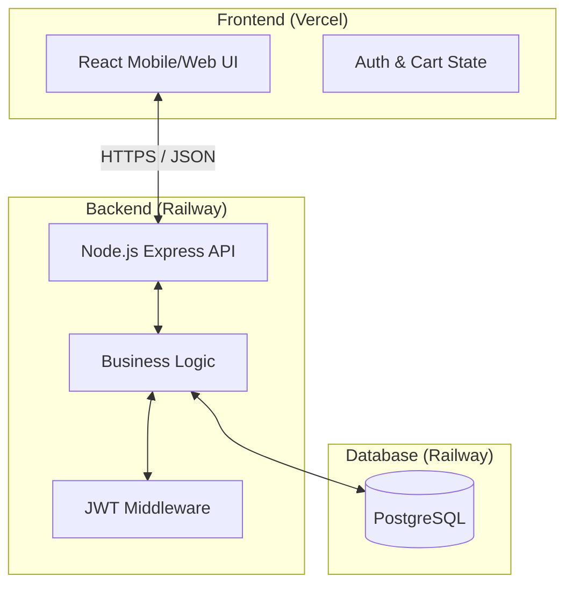
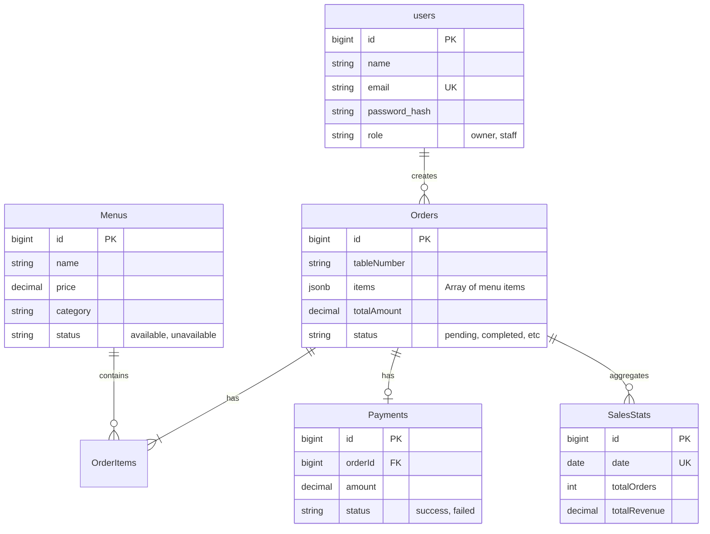
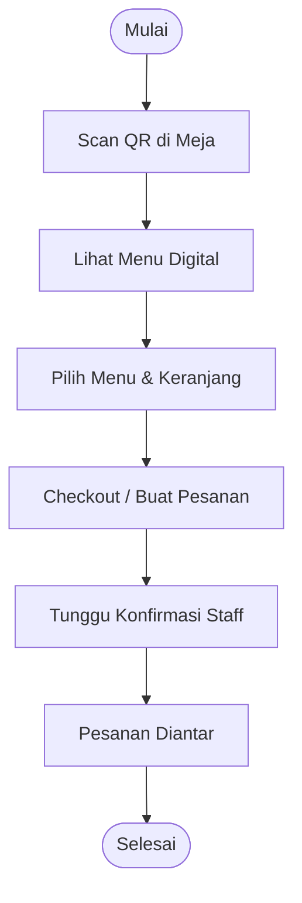
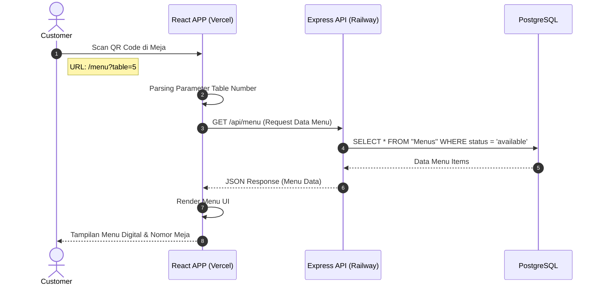

# POS SO Backend 🚀

The engine for the POS SO management system. Built with Node.js and Express, designed for high-performance transaction handling and real-time status tracking.

## 🛠 Tech Stack

- **Runtime**: Node.js
- **Framework**: Express.js
- **Database**: 
  - **Primary**: PostgreSQL (via Sequelize ORM)
  - **Secondary/Diagnostic**: MongoDB
- **Authentication**: JSON Web Token (JWT)
- **Emailing**: Nodemailer (SMTP)
- **Payments**: Midtrans API Integration

---

## 🏗 System Architecture & Design

### 1. Use Case Diagram
Diagram ini menggambarkan siapa saja pengguna sistem (Aktor) dan apa saja fungsi utama yang bisa mereka lakukan.

```mermaid
useCaseDiagram
    actor "Customer" as C
    actor "Staff (Waiter/Chef/Cashier)" as S
    actor "Owner" as O

    package "Restaurant POS System" {
        usecase "Scan QR Table" as UC1
        usecase "View Digital Menu" as UC2
        usecase "Place Order" as UC3
        usecase "Track Order Status" as UC4
        
        usecase "Manage Orders" as UC5
        usecase "Process Payment" as UC6
        usecase "Update Menu Availability" as UC7
        
        usecase "Manage Staff Account" as UC8
        usecase "View Sales Reports" as UC9
        usecase "Manage Menu Content" as UC10
    }

    C --> UC1
    C --> UC2
    C --> UC3
    C --> UC4

    S --> UC5
    S --> UC6
    S --> UC7

    O --> UC8
    O --> UC9
    O --> UC10
    O --> UC5
```

**Penjelasan:**
- **Customer**: Berinteraksi secara mandiri melalui mobile device (Scan QR). Fokus pada reservasi meja dan pemesanan.
- **Staff**: Mengelola siklus hidup pesanan (Kitchen/Service) dan pembayaran.
- **Owner**: Memegang kontrol penuh atas inventaris (Menu), SDM (Staff), dan analitik (Reports).

---

### 2. System Flowmap (Data Flow)
Diagram ini menjelaskan bagaimana data berpindah antar komponen teknis.



**Penjelasan:**
1. **Frontend** mengirimkan request JSON melalui koneksi HTTPS yang aman.
2. **Backend** memverifikasi identitas pengguna menggunakan **JWT Middleware**.
3. **Business Logic** memproses data (misal: menghitung total harga, mengecek stok).
4. **PostgreSQL** menyimpan semua data transaksi secara permanen dan konsisten.

---

### 3. Entity Relationship Diagram (ERD)
Struktur database dan hubungan antar tabel data.



**Penjelasan Relasi:**
- **Orders.items (JSONB)**: Ini adalah fitur unggulan dimana detail item pesanan disimpan dalam satu kolom JSON, sehingga query lebih cepat tanpa banyak join tabel.
- **Payments**: Terhubung langsung ke Order ID (`One-to-One`).
- **SalesStats**: Tabel khusus untuk mempercepat loading grafik dashboard owner dengan menyimpan Ringkasan harian.

---

### 4. Role Flowcharts

#### **Customer Flow (Pemesanan Mandiri)**


#### **Staff Flow (Manajemen Pesanan)**


#### **Owner Flow (Kontrol & Analitik)**


---

### 5. Sequence Diagram: Scan QR & Lihat Menu
Diagram ini mendetailkan interaksi langkah-demi-langkah antara Customer, Browser/Frontend, Backend, dan Database saat proses inisiasi awal.



**Penjelasan:**
1. **Inisiasi**: Pengguna melakukan aksi fisik (scanning) yang mengarahkan browser ke URL spesifik meja.
2. **Parsing**: Frontend mendeteksi nomor meja dari URL agar pesanan nanti otomatis tercatat di meja yang benar.
3. **Data Fetching**: Frontend meminta daftar menu terbaru yang tersedia dari server.
4. **Respon**: Data dikirim dalam format JSON dan ditampilkan ke pengguna dalam UI yang interaktif.

---

## 📂 Project Directory
- `/controllers`: Logika endpoint (Auth, Orders, Menu).
- `/models`: Definisi skema database PostgreSQL.
- `/routes`: Pintu masuk API.
- `/services`: Integrasi pihak ketiga (Midtrans, Email).
- `/middleware`: Keamanan & Verifikasi Auth.

## ⚙️ Setup Lokal
1. `npm install`
2. Konfigurasi `.env` sesuai `.env.example`.
3. `npm run dev`

---
Built with ❤️ for POS SO.
