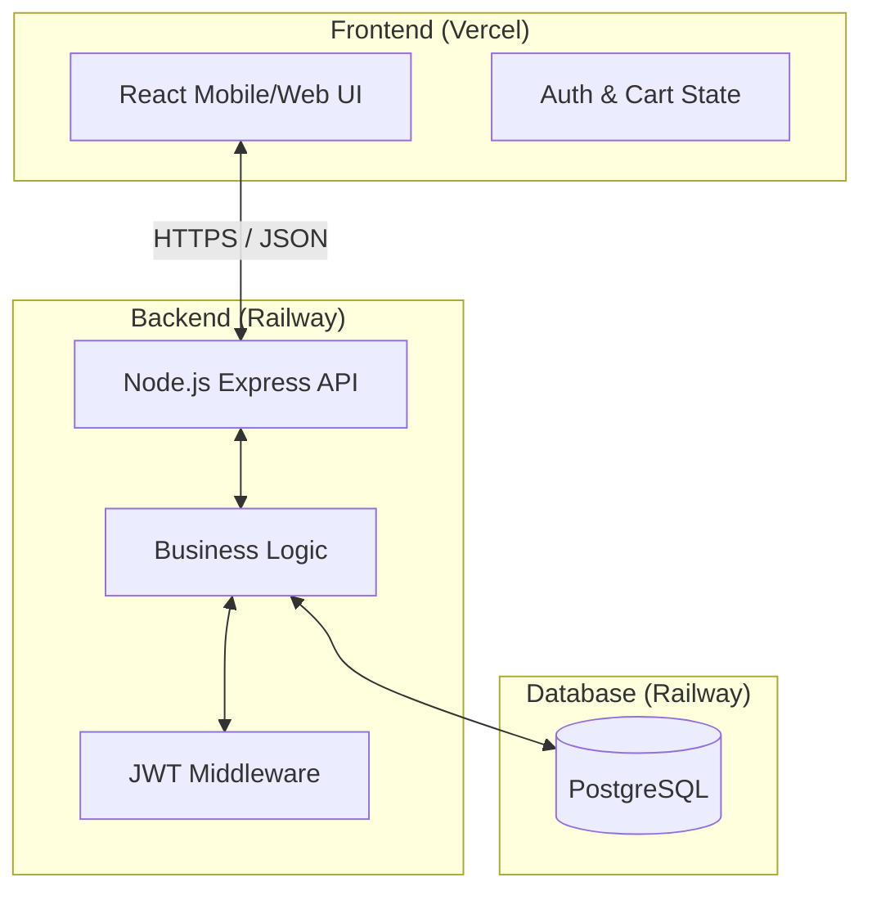
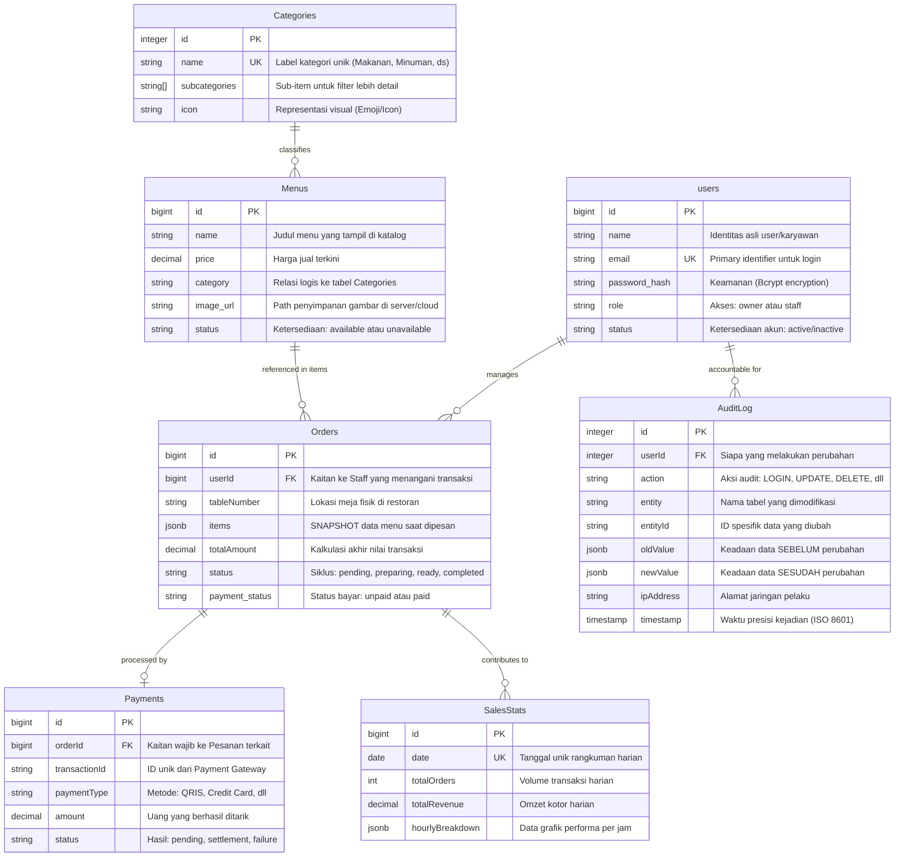
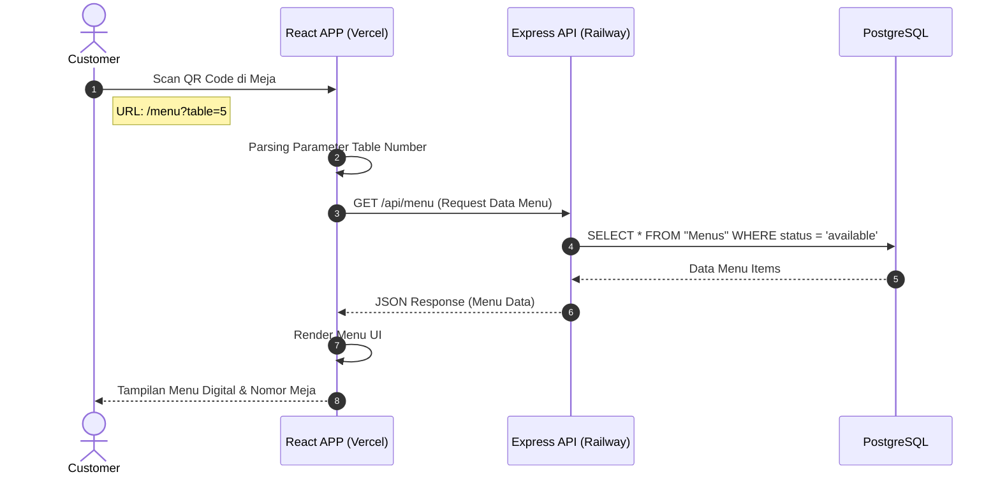
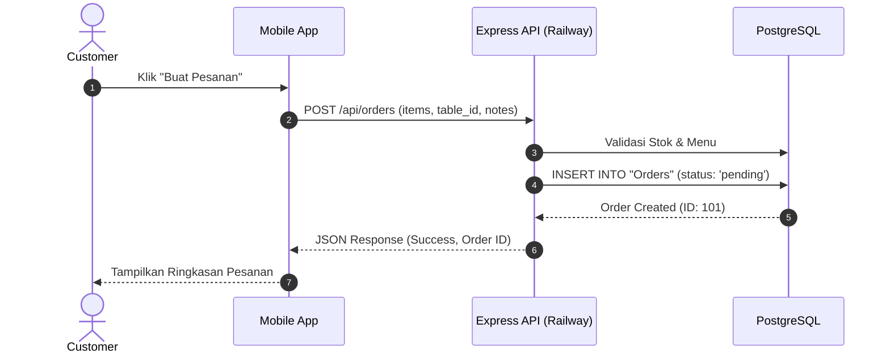
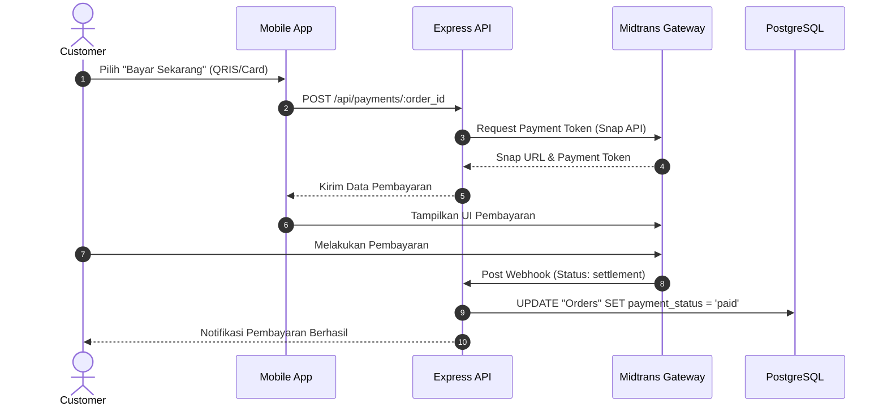
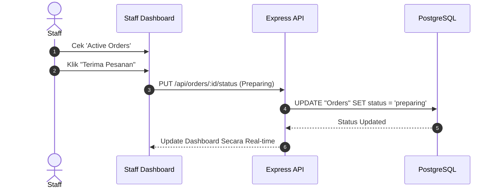
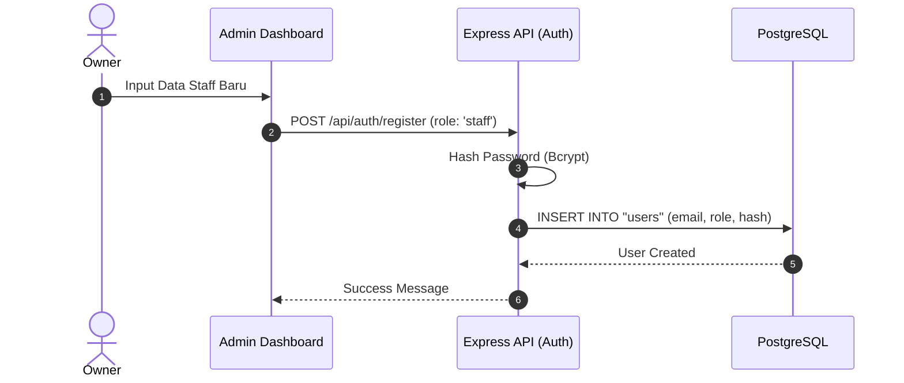
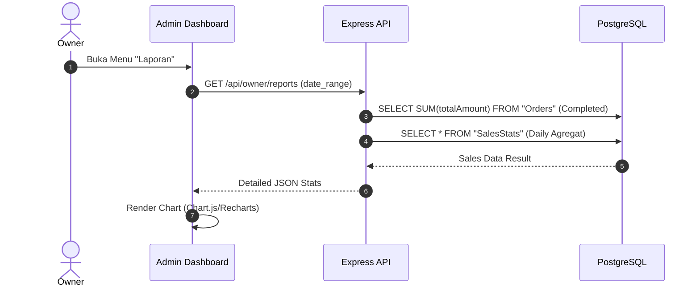
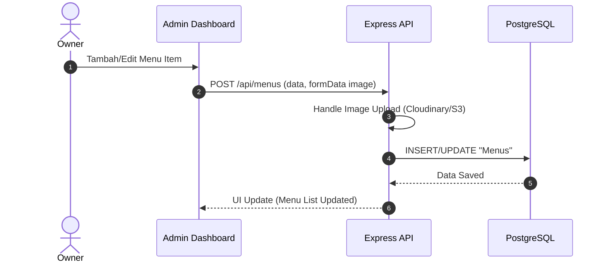

# POS SO Backend 🚀

The engine for the POS SO management system. Built with Node.js and Express, designed for high-performance transaction handling and real-time status tracking.

## 🛠 Tech Stack

- **Runtime**: Node.js
- **Framework**: Express.js
- **Database**: 
  - **Primary**: PostgreSQL (via Sequelize ORM)
  - **Secondary/Diagnostic**: MongoDB
- **Authentication**: JSON Web Token (JWT)
- **Emailing**: Nodemailer (SMTP)
- **Payments**: Midtrans API Integration

---

## 🏗 System Architecture & Design

### 1. Use Case Diagram
Diagram ini menggambarkan siapa saja pengguna sistem (Aktor) dan apa saja fungsi utama yang bisa mereka lakukan.

**Penjelasan Relasi:**
- **Association**: Garis lurus menunjukkan interaksi langsung aktor dengan fungsi.
- **`<<include>>`**: Menunjukkan fungsionalitas yang **wajib** ada. Misal: Staff/Owner **wajib** Login untuk mengelola data. `Place Order` juga menyertakan proses `View Menu`.
- **`<<extend>>`**: Menunjukkan fungsionalitas **opsional**. Misal: `Print Receipt` hanya dilakukan jika pembayaran sukses atau pelanggan meminta.

**Penjelasan:**
- **Customer**: Berinteraksi secara mandiri melalui mobile device (Scan QR). Fokus pada reservasi meja dan pemesanan.
- **Staff**: Mengelola siklus hidup pesanan (Kitchen/Service) dan pembayaran.
- **Owner**: Memegang kontrol penuh atas inventaris (Menu), SDM (Staff), dan analitik (Reports).

---

### 2. System Flowmap (Data Flow)
Diagram ini menjelaskan bagaimana data berpindah antar komponen teknis.

**Penjelasan:**
1. **Frontend** mengirimkan request JSON melalui koneksi HTTPS yang aman.
2. **Backend** memverifikasi identitas pengguna menggunakan **JWT Middleware**.
3. **Business Logic** memproses data (misal: menghitung total harga, mengecek stok).
4. **PostgreSQL** menyimpan semua data transaksi secara permanen dan konsisten.

---

### 3. Entity Relationship Diagram (ERD)
Dokumentasi ini menyajikan arsitektur database relasional yang dirancang untuk mendukung sistem POS SO agar memiliki integritas data yang tinggi, audit trail yang aman, dan performa dashboard yang optimal.

---

#### 📋 Penjelasan Mendalam Mengenai Tabel (Deep Dive)

Arsitektur database ini dirancang agar data tidak hanya tersimpan, tetapi juga memiliki fungsi kontrol, akurasi finansial, dan audit yang sangat ketat:

1.  **Tabel `users` (Manajemen Pengguna & Akses)**
    *   **Fungsi Utama**: Menjadi pusat kendali identitas sistem. Setiap akses ke dashboard admin (Owner atau Staff) harus melalui validasi tabel ini.
    *   **Keamanan Tingkat Tinggi**: Sistem **tidak pernah** menyimpan password dalam bentuk teks biasa. Kolom `password_hash` menyimpan kunci terenkripsi (Bcrypt) yang hampir mustahil untuk ditembus, menjamin privasi pengguna meskipun database terekspos.
    *   **Role-Based Access Control (RBAC)**: Melalui kolom `role`, sistem memisahkan hak akses secara otomatis. Owner memiliki akses ke laporan keuangan (SalesStats) dan SDM (AuditLog), sementara Staff hanya memiliki akses ke operasional pesanan (Orders).

2.  **Tabel `Categories` (Struktur Organisasi Menu)**
    *   **Fungsi Utama**: Memberikan struktur hirarkis pada katalog produk agar pelanggan tidak bingung saat memesan.
    *   **Fleksibilitas Data**: Field `subcategories` menggunakan tipe data *Array*, memungkinkan satu kategori (misal: "Minuman") memiliki banyak turunan ("Kopi", "Teh", "Susu") dalam satu baris data saja, sehingga query lebih efisien.
    *   **Daya Tarik Visual**: Kolom `icon` menyimpan informasi visual yang mempercantik tampilan menu digital di sisi pelanggan.

3.  **Tabel `Menus` (Pusat Informasi Produk)**
    *   **Fungsi Utama**: Katalog master produk restoran.
    *   **Manajemen Inventaris Digital**: Kolom `status` bertindak sebagai sakelar (*switch*). Jika menu habis, owner cukup mengubahnya ke `unavailable` agar otomatis hilang dari menu QR pelanggan tanpa menghapus riwayat datanya.

4.  **Tabel `Orders` (Inti Transaksi & Integritas Sejarah)**
    *   **Inovasi Teknologi: JSONB Snapshot**: Ini adalah bagian paling cerdas dari arsitektur ini. Sistem menyimpan data menu (Nama & Harga saat itu) langsung ke dalam satu kolom `items` berformat JSONB.
    *   **Kenapa Ini Krusial?**: Dalam dunia nyata, harga makanan sering naik-turun. Jika harga "Nasi Goreng" naik besok di tabel `Menus`, pesanan yang dibuat pelanggan hari ini tidak akan ikut naik. Data "difoto" (snapshot) pada saat transaksi dibuat agar laporan keuangan masa lalu tetap akurat selamanya.

5.  **Tabel `Payments` (Jembatan Rekonsiliasi Gateway)**
    *   **Fungsi Utama**: Mencatat bukti sah pembayaran digital.
    *   **Sinkronisasi Payment Gateway**: Kolom `transactionId` menyimpan ID unik dari Midtrans. Ini memungkinkan sistem melakukan sinkronisasi otomatis via Webhook; jika pelanggan membayar di HP-nya, database akan otomatis terupdate tanpa perlu konfirmasi manual dari kasir.

6.  **Tabel `SalesStats` (Optimasi Performa Dashboard)**
    *   **Fungsi Utama**: Tabel agregasi untuk mendukung visualisasi grafik owner.
    *   **Strategi Anti-Lag**: Jika sistem harus menghitung ribuan transaksi setiap kali Owner membuka laporan, dashboard akan menjadi sangat lambat. Tabel ini secara otomatis merangkum pendapatan kotor dan jumlah order secara harian agar tampilan grafik (Charts) muncul secara instan di layar Owner.

7.  **Tabel `AuditLog` (Sistem Pertanggungjawaban/Forensik)**
    *   **Fungsi Utama**: Mesin waktu dan sistem pengawasan keamanan.
    *   **Transparansi Mutlak**: Setiap aksi "berbahaya" (seperti mengubah harga menu, menghapus staff, atau membatalkan pesanan yang sudah dibayar) akan dicatat di sini. Tabel ini menyimpan data SEBELUM (`oldValue`) dan SESUDAH (`newValue`) perubahan, sehingga jika terjadi kecurangan internal, Owner dapat melacak siapa pelakunya berdasarkan `ipAddress` dan `userId`.

---

#### 🔗 Narasi Relasi Logika (Arsitektur Komunikasi Data)

Database ini menggunakan relasi yang saling mengunci untuk menjaga konsistensi:

*   **Relationship `users` → `Orders`**: Menciptakan akuntabilitas. Kita selalu tahu staff mana yang melayani meja tertentu melalui tautan Foreign Key ini.
*   **Relationship `Categories` → `Menus`**: Menjamin keteraturan. Setiap menu wajib memiliki kategori agar sistem navigasi pelanggan tidak berantakan.
*   **Relationship `Orders` → `Payments`**: Hubungan ketergantungan 1-ke-1. Sebuah pembayaran dianggap tidak sah (orphan) jika tidak tertaut pada baris pesanan yang ada di tabel Orders.
*   **Relationship `users` → `AuditLog`**: Hubungan pengawasan. Memberikan transparansi penuh kepada pihak manajemen atas setiap pergerakan data di dalam sistem.

---

### 4. Role Flowcharts

#### **Customer Flow (Pemesanan Mandiri)**

#### **Staff Flow (Manajemen Pesanan)**

#### **Owner Flow (Kontrol & Analitik)**

---

### 5. Sequence Diagram: Scan QR & Lihat Menu
Diagram ini mendetailkan interaksi langkah-demi-langkah antara Customer, Browser/Frontend, Backend, dan Database saat proses inisiasi awal.

**Penjelasan:**
1. **Inisiasi**: Pengguna melakukan aksi fisik (scanning) yang mengarahkan browser ke URL spesifik meja.
2. **Parsing**: Frontend mendeteksi nomor meja dari URL agar pesanan nanti otomatis tercatat di meja yang benar.
3. **Data Fetching**: Frontend meminta daftar menu terbaru yang tersedia dari server.
4. **Respon**: Data dikirim dalam format JSON dan ditampilkan ke pengguna dalam UI yang interaktif.

---

### 6. Sequence Diagram: Input Pesanan
Proses saat pelanggan melakukan checkout pesanan dari keranjang belanja.

---

### 7. Sequence Diagram: Bayar Pesanan
Alur integrasi dengan Payment Gateway untuk penyelesaian transaksi.

---

### 8. Sequence Diagram: Update Status Pesanan
Proses manajemen pesanan oleh Staff (Dapur/Pelayan).

---

### 9. Sequence Diagram: Kelola Staff
Manajemen akun karyawan oleh Owner.

---

### 10. Sequence Diagram: Dashboard Analitik
Proses penarikan data performa untuk laporan owner.

---

### 11. Sequence Diagram: Kelola Data Menu
Manajemen katalog produk oleh Owner.

---

## 📂 Project Directory
- `/controllers`: Logika endpoint (Auth, Orders, Menu).
- `/models`: Definisi skema database PostgreSQL.
- `/routes`: Pintu masuk API.
- `/services`: Integrasi pihak ketiga (Midtrans, Email).
- `/middleware`: Keamanan & Verifikasi Auth.
- `BLACKBOX_TESTING.md`: Laporan hasil pengujian fungsional sistem.
- `LAPORAN_PRAKTIKUM_RPL.md`: Dokumentasi lengkap analisis sistem, flowgraph, & white-box testing.

## ⚙️ Setup Lokal
1. `npm install`
2. Konfigurasi `.env` sesuai `.env.example`.
3. `npm run dev`

---
Built with ❤️ for POS SO.
