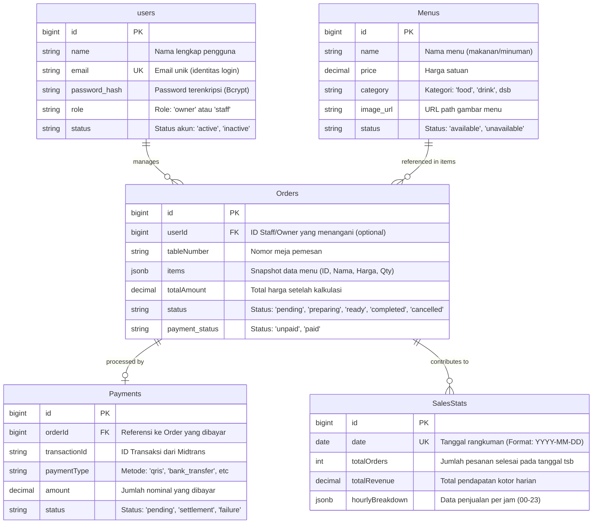

# POS SO Backend 🚀

The engine for the POS SO management system. Built with Node.js and Express, designed for high-performance transaction handling and real-time status tracking.

## 🛠 Tech Stack

- **Runtime**: Node.js
- **Framework**: Express.js
- **Database**: 
  - **Primary**: PostgreSQL (via Sequelize ORM)
  - **Secondary/Diagnostic**: MongoDB
- **Authentication**: JSON Web Token (JWT)
- **Emailing**: Nodemailer (SMTP)
- **Payments**: Midtrans API Integration

---

## 🏗 System Architecture & Design

### 1. Use Case Diagram
Diagram ini menggambarkan siapa saja pengguna sistem (Aktor) dan apa saja fungsi utama yang bisa mereka lakukan.

```mermaid
graph LR
    subgraph "Restaurant POS System"
        UC_Login([Login & Auth])
        
        UC1([Scan QR Table])
        UC2([View Digital Menu])
        UC3([Place Order])
        UC4([Track Order Status])
        
        UC5([Manage Orders])
        UC6([Process Payment])
        UC_Print([Print Receipt])
        
        UC8([Manage Staff Account])
        UC9([View Sales Reports])
        UC10([Manage Menu Content])
    end

    C["👤 Customer"]
    S["👨‍🍳 Staff"]
    O["👑 Owner"]

    %% Direct Associations
    C --> UC1
    C --> UC2
    C --> UC3
    C --> UC4

    S --> UC5
    S --> UC6
    
    O --> UC8
    O --> UC9
    O --> UC10
    O --> UC5

    %% Include & Extend Relationships
    UC5 -. "&laquo;include&raquo;" .-> UC_Login
    UC8 -. "&laquo;include&raquo;" .-> UC_Login
    UC9 -. "&laquo;include&raquo;" .-> UC_Login
    UC10 -. "&laquo;include&raquo;" .-> UC_Login
    
    UC6 -. "&laquo;extend&raquo;" .-> UC_Print
    UC3 -. "&laquo;include&raquo;" .-> UC2
```

**Penjelasan Relasi:**
- **Association**: Garis lurus menunjukkan interaksi langsung aktor dengan fungsi.
- **`<<include>>`**: Menunjukkan fungsionalitas yang **wajib** ada. Misal: Staff/Owner **wajib** Login untuk mengelola data. `Place Order` juga menyertakan proses `View Menu`.
- **`<<extend>>`**: Menunjukkan fungsionalitas **opsional**. Misal: `Print Receipt` hanya dilakukan jika pembayaran sukses atau pelanggan meminta.

**Penjelasan:**
- **Customer**: Berinteraksi secara mandiri melalui mobile device (Scan QR). Fokus pada reservasi meja dan pemesanan.
- **Staff**: Mengelola siklus hidup pesanan (Kitchen/Service) dan pembayaran.
- **Owner**: Memegang kontrol penuh atas inventaris (Menu), SDM (Staff), dan analitik (Reports).

---

### 2. System Flowmap (Data Flow)
Diagram ini menjelaskan bagaimana data berpindah antar komponen teknis.

**Penjelasan:**
1. **Frontend** mengirimkan request JSON melalui koneksi HTTPS yang aman.
2. **Backend** memverifikasi identitas pengguna menggunakan **JWT Middleware**.
3. **Business Logic** memproses data (misal: menghitung total harga, mengecek stok).
4. **PostgreSQL** menyimpan semua data transaksi secara permanen dan konsisten.

---

### 3. Entity Relationship Diagram (ERD)
Dokumentasi ini menjelaskan arsitektur data, fungsi tabel, dan keterkaitan antar entitas dalam database PostgreSQL.

---

#### 📋 Deskripsi Tabel & Fungsi
1. **Tabel `users`**
   - **Fungsi**: Menyimpan data kredensial dan hak akses (RBAC). 
   - **Pentingnya**: Keamanan aplikasi bergantung pada enkripsi `password_hash` dan validasi `role` untuk membatasi akses dashboard.

2. **Tabel `Menus`**
   - **Fungsi**: Katalog master produk restoran.
   - **Pentingnya**: Menyediakan data dasar untuk ditampilkan ke pelanggan saat Scan QR. Item di tabel ini bersifat dinamis (bisa diaktifkan/nonaktifkan via dashboard).

3. **Tabel `Orders`**
   - **Fungsi**: Janting dari transaksi digital.
   - **Detail Teknis**: Menggunakan kolom **JSONB `items`**. 
     - *Kenapa?* Untuk menyimpan "Snapshot" menu pada saat dipesan. Jika harga menu di master berubah di masa depan, data history transaksi tetap akurat.
   - **Relasi**: Terhubung ke `users` (siapa yang melayani) dan meja spesifik.

4. **Tabel `Payments`**
   - **Fungsi**: Log transaksi keuangan.
   - **Detail Teknis**: Menyimpan `transactionId` yang unik untuk sinkronisasi dengan Webhook Payment Gateway (Midtrans).

5. **Tabel `SalesStats` (Normalization Level: Optimization)**
   - **Fungsi**: Tabel agregasi untuk performa dashboard.
   - **Strategi**: Daripada menghitung log ribuan order setiap kali owner membuka dashboard, sistem melakukan *upsert* ke tabel ini setiap kali pesanan selesai. Hal ini membuat pemuatan grafik (Charts) menjadi instan.

---

#### 🔗 Penjelasan Relasi (Cardinality)
- **One-to-Many (`users` -> `Orders`)**: Satu staff/owner dapat menangani banyak pesanan, namun satu pesanan spesifik memiliki tanggung jawab personil tertentu.
- **One-to-One / Zero-to-One (`Orders` -> `Payments`)**: Satu pesanan hanya memiliki satu catatan pembayaran yang sah. Statusnya bisa kosong (jika belum bayar) atau terisi.
- **Dependency (`Menus` -> `Orders`)**: Meskipun tidak ada *Hard Foreign Key* ke `Menus` secara langsung di database (karena menggunakan JSONB items), secara logika bisnis `Orders` bergantung pada entitas `Menus` sebagai sumber data.

**Penjelasan Relasi:**
- **Orders.items (JSONB)**: Ini adalah fitur unggulan dimana detail item pesanan disimpan dalam satu kolom JSON, sehingga query lebih cepat tanpa banyak join tabel.
- **Payments**: Terhubung langsung ke Order ID (`One-to-One`).
- **SalesStats**: Tabel khusus untuk mempercepat loading grafik dashboard owner dengan menyimpan Ringkasan harian.

---

### 4. Role Flowcharts

#### **Customer Flow (Pemesanan Mandiri)**

#### **Staff Flow (Manajemen Pesanan)**

#### **Owner Flow (Kontrol & Analitik)**

---

### 5. Sequence Diagram: Scan QR & Lihat Menu
Diagram ini mendetailkan interaksi langkah-demi-langkah antara Customer, Browser/Frontend, Backend, dan Database saat proses inisiasi awal.

**Penjelasan:**
1. **Inisiasi**: Pengguna melakukan aksi fisik (scanning) yang mengarahkan browser ke URL spesifik meja.
2. **Parsing**: Frontend mendeteksi nomor meja dari URL agar pesanan nanti otomatis tercatat di meja yang benar.
3. **Data Fetching**: Frontend meminta daftar menu terbaru yang tersedia dari server.
4. **Respon**: Data dikirim dalam format JSON dan ditampilkan ke pengguna dalam UI yang interaktif.

---

### 6. Sequence Diagram: Input Pesanan
Proses saat pelanggan melakukan checkout pesanan dari keranjang belanja.

---

### 7. Sequence Diagram: Bayar Pesanan
Alur integrasi dengan Payment Gateway untuk penyelesaian transaksi.

---

### 8. Sequence Diagram: Update Status Pesanan
Proses manajemen pesanan oleh Staff (Dapur/Pelayan).

---

### 9. Sequence Diagram: Kelola Staff
Manajemen akun karyawan oleh Owner.

---

### 10. Sequence Diagram: Dashboard Analitik
Proses penarikan data performa untuk laporan owner.

---

### 11. Sequence Diagram: Kelola Data Menu
Manajemen katalog produk oleh Owner.

---

## 📂 Project Directory
- `/controllers`: Logika endpoint (Auth, Orders, Menu).
- `/models`: Definisi skema database PostgreSQL.
- `/routes`: Pintu masuk API.
- `/services`: Integrasi pihak ketiga (Midtrans, Email).
- `/middleware`: Keamanan & Verifikasi Auth.
- `BLACKBOX_TESTING.md`: Laporan hasil pengujian fungsional sistem.

## ⚙️ Setup Lokal
1. `npm install`
2. Konfigurasi `.env` sesuai `.env.example`.
3. `npm run dev`

---
Built with ❤️ for POS SO.
